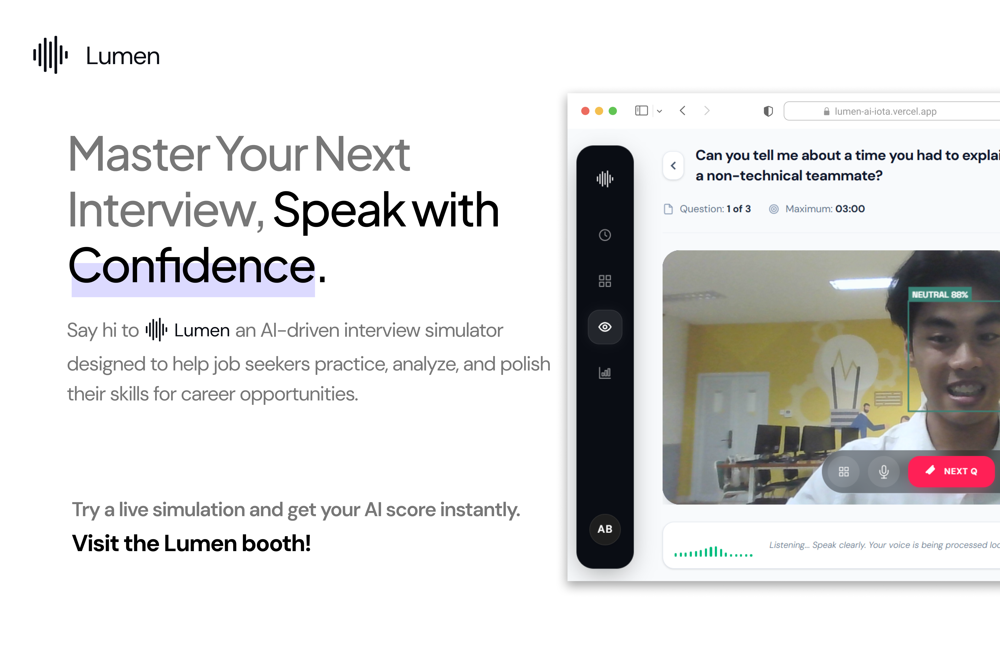

# `lumen`

**Platform Simulasi Wawancara Berbasis AI dengan Penilaian Multimodal**

---

## Team

| **Name**                    | **Role**                                               |
| --------------------------- | ------------------------------------------------------ |
| Muhammad Karov Ardava Barus | Lead, AI Engineer, Fullstack Developer, UI/UX Designer |
| Muhammad Umar               | Computer Vision &amp; Pipeline Fusion Specialist       |
| Muhammad Naufal Satria      | Audi &amp; Linguistic (NLP) Specialist                 |
| Muhammad Rafif Radithya     | Computer Vision Specialist, UI/UX Designer             |

---

## 1. Masalah: Kurangnya Umpan Balik Objektif dalam Persiapan Wawancara

Banyak kandidat pencari kerja menghadapi kecemasan dan kurangnya umpan balik objektif saat berlatih untuk wawancara kerja. Sesi latihan secara mandiri sulit diukur progresnya, sementara menggunakan jasa profesional seringkali mahal. **Lumen** hadir untuk memberikan pengalaman simulasi wawancara yang mendekati kondisi nyata dengan analisis kuantitatif dan kualitatif berbasis kecerdasan buatan.

## 2. Solusi: Simulasi Multimodal Berbasis AI (Edge Computing)

**Lumen** adalah platform simulasi wawancara cerdas yang mengevaluasi kandidat melalui berbagai aspek komunikasi (video, audio, dan teks):

- **Analisis Multimodal SOTA:** Menggunakan integrasi **Whisper** untuk transkripsi, **Wav2Vec2** untuk emosi suara, **S-BERT** untuk relevansi konten, dan **YOLOv8** untuk analisis ekspresi wajah.
- **Umpan Balik Holistik:** Tidak hanya menilai *apa* yang diucapkan (konten), tetapi juga *bagaimana* cara mengucapkannya (kecepatan bicara, *filler words*) dan bahasa tubuhnya (*non-verbal*).
- **Privacy-First Architecture:** Proses inferensi model ML berjalan di jaringan lokal, sehingga rekaman video/audio kandidat tidak pernah dikirim ke layanan *cloud* publik.

## 3. Tech Stack &amp; Engineering Excellence

Kami menggunakan arsitektur monorepo yang dirancang untuk menjalankan pemrosesan ML tingkat lanjut secara lokal:

| Komponen                   | Teknologi                | Peran                                                                                            |
| :-------------------------- | :------------------------ | :------------------------------------------------------------------------------------------------ |
| **Frontend**               | **Next.js 16**           | Antarmuka pengguna *real-time* dengan fitur perekaman via *browser* dan *overlay* emosi dinamis. |
| **Backend**                | **FastAPI**              | REST API asinkron untuk orkestrasi pemrosesan media (ffmpeg) dan eksekusi model ML.              |
| **ASR &amp; NLP Engine**   | **Whisper &amp; S-BERT** | Model transkripsi ucapan yang akurat (anti-halusinasi) dan model *semantic-similarity* jawaban.  |
| **Audio &amp; SER Engine** | **Wav2Vec2**             | Ekstraksi *delivery metrics* (WPM, *pauses*) dan *Speech Emotion Recognition*.                   |
| **Computer Vision**        | **YOLOv8 &amp; OpenCV**  | Ekstraksi *bounding box* wajah dan sentimen ekspresi setiap *frame* secara lokal.                |

## 4. Fitur Utama

### A. Real-Time Recording &amp; Preflight

- **Model Preflight:** Pengecekan status pemuatan model AI di latar belakang untuk memastikan sesi wawancara lancar.
- **Live Emotion Overlay:** Kandidat dapat melihat deteksi *bounding box* wajah dan sentimen emosinya langsung saat perekaman berlangsung.

### B. Multimodal Scoring System (Weighted Fusion)

Penilaian akhir dihitung secara komprehensif (0-100) dari berbagai model ML:

- **40% Konten:** Relevansi Q↔A menggunakan S-BERT, kelengkapan, dan struktur jawaban.
- **30% Delivery:** Analisis kelancaran berbicara (WPM), *filler words*, jeda, dan emosi suara (*Wav2Vec2*).
- **30% Non-verbal:** Distribusi ekspresi wajah (YOLOv8), stabilitas visual, dan tingkat kecemasan.

### C. Comprehensive Report Cards

- Menyajikan hasil analisis *breakdown* per pertanyaan (skor komposit, *delivery metrics*, *emotion metrics*).
- Menyediakan transkripsi *Whisper* lengkap beserta umpan balik teks untuk langkah perbaikan.

### D. Dashboard &amp; History

- Melacak riwayat simulasi kandidat, menampilkan ringkasan skor keseluruhan, dan menyediakan pemilihan topik khusus untuk berbagai ranah wawancara.

## 5. Cara Menjalankan (Local Development)

### Prasyarat:

Pastikan **Node.js 20+**, **Python 3.13+**, **uv**, dan **ffmpeg** sudah terinstal di sistem Anda.

### Backend:

1. `cd backend`
2. `uv sync`
3. `uv run uvicorn main:app --reload --port 8000`

### Frontend:

1. `cd frontend`
2. `npm ci`
3. `npm run dev`

